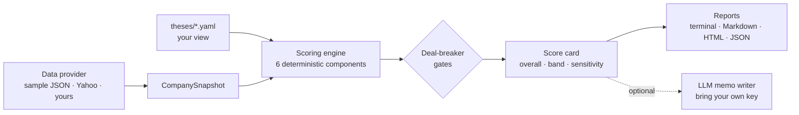

# Keystone Thesis Engine

**Write your investment thesis in YAML. Score any company 0–100 against it.**


Most stock screeners ask "is this a good company?" Keystone asks a better question: **"is this a good company *for my thesis*?"** You write down what you believe once, in a plain YAML file: the themes you are betting on, the macro signals your view depends on, what a winner looks like, how hard to stress the balance sheet, which red flags you will not ignore and how much valuation risk you accept. The engine then scores companies against it, component by component, and shows its working for every number.

Change the thesis and the answer changes. The same fictional retailer, scored under two theses that ship with the repo:

| Thesis | Overall | Band | Theme fit | Macro | Strategy | Resilience | Execution | Valuation |
|---|---:|---|---:|---:|---:|---:|---:|---:|
| India Structural Growth | **61.4** | Strong fit | 25 | 75 | 52 | 90 | 90 | 5 |
| Quality Compounders | **72.2** | Compounder | 69 | 85 | 77 | 90 | 90 | 10 |

> This repository is a **template**. Click **Use this template** to get your own copy, then edit `theses/` and `data/`.

---

## Quick start (no API keys)

```bash
git clone https://github.com/Kaushik05code/keystone-thesis-engine.git
cd keystone-thesis-engine
pip install -e .

keystone list                                            # theses + sample companies
keystone score ARYADEF --thesis india_structural_growth  # one company, terminal summary
keystone rank --thesis quality_compounders               # leaderboard
keystone compare METROFASH                               # one company, every thesis
keystone score ARYADEF -t india_structural_growth -o reports/   # Markdown + HTML + JSON report
```

```
Arya Defence Electronics Ltd (ARYADEF)  vs  India Structural Growth
Overall 77.6 / 100 · Exceptional fit
  Theme fit                   90.0  ██████████████████░░  ×18%
  Macro alignment             76.7  ███████████████░░░░░  ×12%
  Strategy fit                89.8  ██████████████████░░  ×22%
  Financial resilience        90.0  ██████████████████░░  ×22%
  Execution risk (inverse)    68.0  ██████████████░░░░░░  ×18%
  Valuation tolerance          5.0  █░░░░░░░░░░░░░░░░░░░  ×8%
  Data coverage 100% · fictional sample company
```

The bundled companies in `data/sample/` are **fictional** so the repo runs offline and the tests are deterministic. See [`examples/`](examples/) for full reports.

**Real companies, still no key:** `pip install -e ".[live]"`, then

```bash
keystone score HAL.NS TCS.NS --thesis india_structural_growth --provider yahoo
```

---

## How a thesis becomes a score

Every thesis defines six components. Each one is scored 0–100 by deterministic rules that you control from the YAML file, then weighted into the overall score.

| # | Component | The question it answers | What you set in the thesis |
|---|---|---|---|
| 1 | **Theme fit** | Is the company's revenue in the part of the economy my thesis bets on? | Themes, keywords, a "necessity" score per theme |
| 2 | **Macro alignment** | Do the macro signals my view depends on support it right now? | Signals, current values, thresholds, trends, which themes they apply to |
| 3 | **Strategy fit** | Does it look like the winners I expect? | Traits (growth, ROCE, R&D, exports, margins, cash conversion…) with good/bad thresholds |
| 4 | **Financial resilience** | How many months does it survive my stress cases? | Revenue shocks, margin hits, capex cuts, a runway-to-score curve, leverage adjustments |
| 5 | **Execution risk** | Which red flags fire? | Red-flag rules (promoter pledge, customer concentration, auditor changes…) and penalties |
| 6 | **Valuation tolerance** | How much growth is already in the price? | Reverse DCF: cost of equity, stage length, terminal growth, gap-to-score brackets |

On top of that, **deal-breaker gates** cap the score of any company that fails a hard rule (for example, promoter pledge above 25%), and **bands** turn the number into a verdict.



Design choices that matter:

- **Scores are never produced by an LLM.** Every number is computed from the thesis file and the company data, so the same inputs always give the same score, and every score traces back to a rule you wrote.
- **Missing data is flagged, not rewarded.** If a red flag cannot be checked, the execution score is capped; if trait data is thin, strategy fit is pulled toward neutral. Each report shows its data coverage.
- **Conservative caps.** Resilience maxes out at 90 because unknown risks always exist; macro maxes out at 85 because macro can turn.
- **Sensitivity built in.** Every report shows how the overall score moves if any component shifts by ±10 or ±20 points.

---

## Write your own thesis

```bash
keystone new-thesis ai_infrastructure        # copies the commented template to theses/
# edit theses/ai_infrastructure.yaml
keystone validate theses/ai_infrastructure.yaml
keystone rank --thesis ai_infrastructure
```

A trimmed example of what you edit:

```yaml
weights: {theme_fit: 0.18, macro_alignment: 0.12, strategy_fit: 0.22,
          financial_resilience: 0.22, execution_risk: 0.18, valuation_tolerance: 0.08}

themes:
  unmapped_score: 25
  list:
    - {id: defence, name: Defence & aerospace, necessity: 90, keywords: [defence, radar, avionics]}

strategy:
  traits:
    - {id: returns, name: ROCE (%), metric: roce, good: 22, bad: 9, weight: 0.25}

execution:
  red_flags:
    - {id: pledge, name: Promoter shares pledged, metric: promoter_pledge_pct, above: 10, penalty: 20}

gates:
  rules:
    - {id: no_heavy_pledge, name: Promoter pledge below 25%, metric: promoter_pledge_pct, below: 25}
```

Theses in this repo:

| File | View |
|---|---|
| [`india_structural_growth.yaml`](theses/india_structural_growth.yaml) | The original Keystone thesis: companies built to compound through India's next 10–20 years (defence, energy transition, semiconductors, logistics, water, critical minerals…). |
| [`quality_compounders.yaml`](theses/quality_compounders.yaml) | Sector-agnostic quality at a reasonable price: high ROCE, cash conversion, low leverage, sensible valuation. |
| [`_template.yaml`](theses/_template.yaml) | Fully commented starting point. |

> The macro values in the bundled theses are **illustrative**. Update them from current data before relying on any score.

---

## Company data

Scoring needs a `CompanySnapshot`: descriptive text, revenue segments and a flat dictionary of metrics. Three ways to supply it:

1. **JSON files** (default). One file per ticker in a folder; see [`data/sample/`](data/sample/) for the format. Use `--data-dir my_data/` to point at your own research, including data only you have, such as channel checks or management-meeting notes turned into flags.
2. **Yahoo Finance** (`--provider yahoo`). Free, keyless, fetched live. Yahoo does not publish promoter pledging or customer concentration, so those red flags show as *unchecked* and the report says so.
3. **Your own provider.** Subclass `DataProvider` in `keystone_thesis/providers/` (for example, a Screener.in export or a broker API).

Metrics the bundled theses read: `revenue_ltm, revenue_cagr_3y, ebitda_margin, roce, cash, total_debt, interest_expense, capex, debt_due_12m, undrawn_credit, pe, rnd_pct_revenue, export_share_pct, promoter_holding_pct, promoter_pledge_pct, top_customer_share_pct, receivable_days, auditor_changes_3y, related_party_revenue_pct, fcf_conversion_pct`. A thesis can reference any metric you add.

---

## Optional AI layer (bring your own key)

```bash
cp .env.example .env     # any OpenAI-compatible endpoint: OpenAI, OpenRouter, Groq, or local Ollama
keystone score ARYADEF -t india_structural_growth --memo -o reports/
```

- `--memo` adds an investment-committee memo written *from* the score card (verdict, positives and red flags with their data, what would move the score, and the data gaps to close first). The model is told not to invent numbers.
- `--llm` asks the model to map revenue to themes when keywords leave most of it unmapped.

The LLM never changes a score.

---

## Repository layout

```
keystone-thesis-engine/
├── theses/                  # your views: one YAML file per thesis
├── data/sample/             # fictional company snapshots (offline demo + tests)
├── keystone_thesis/
│   ├── thesis.py            # load + validate thesis files
│   ├── company.py           # CompanySnapshot + derived metrics
│   ├── scoring/             # six component scorers, engine, sensitivity
│   ├── providers/           # sample JSON, Yahoo Finance, add your own
│   ├── agents/              # optional LLM theme-mapper and memo writer
│   ├── report/              # Markdown + standalone HTML renderers
│   └── cli.py               # `keystone` command
├── examples/                # generated reports and leaderboards
└── tests/                   # pytest suite: `pytest -q`
```

## Where this came from

I built the first version of Keystone at university for my own investing. It was a 10-agent pipeline (FastAPI, several market-data APIs, an LLM at every step) that scored Indian equities on how well they fit India's long-term growth path. It worked, but it needed six API keys to run, and the thesis was hard-coded into prompts and lookup tables.

This version keeps what mattered (the six-part scoring model, strictness caps, stress tests, sensitivity tables and the audit trail) and moves every judgement into a thesis file anyone can edit. It is built with Claude Code, and it runs offline in seconds.

## Disclaimer

This is a research tool, not investment advice. The sample companies are fictional, the bundled macro values are illustrative, and every score is only as good as the thesis and data you give it.

## License

MIT © 2026 Kaushik G L
